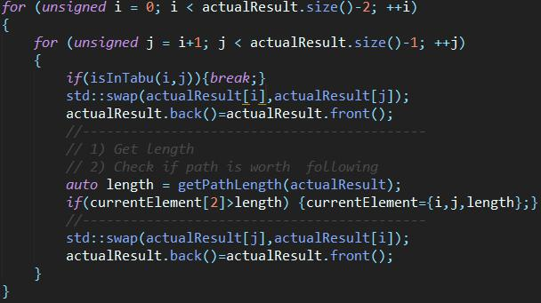
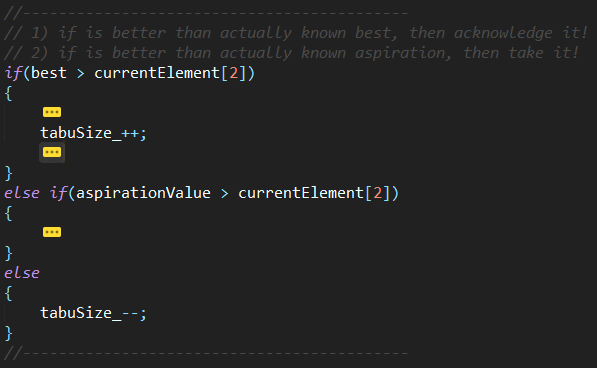
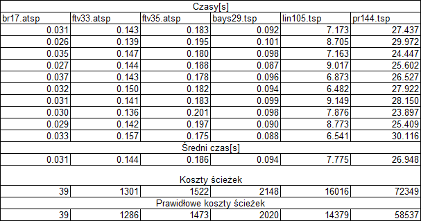
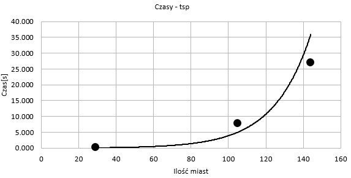
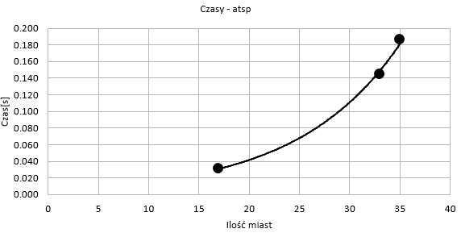
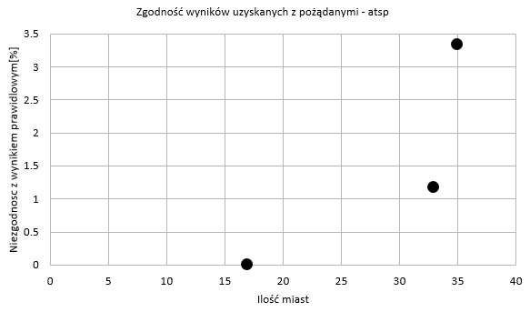
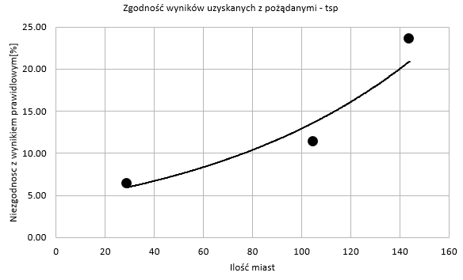

 <link rel="stylesheet" href="style.css">

# Sprawozdanie z projektu PEA
## Tabu search
## 12/14/2017

Prowadzący
_Jarosław Rudy_

### Wstęp
#### Przeszukiwanie tabu (Tabu search, TS)
>Metaheurystyka (algorytm) stosowana do rozwiązywania problemów optymalizacyjnych. Wykorzystywana do otrzymywania rozwiązań optymalnych lub niewiele różniących się od niego dla problemów z różnych dziedzin (np. planowanie, planowanie zadań). Twórcą algorytmu jest Fred Glover.
Podstawową ideą algorytmu jest przeszukiwanie przestrzeni, stworzonej ze wszystkich możliwych rozwiązań, za pomocą sekwencji ruchów. W sekwencji ruchów istnieją ruchy niedozwolone, ruchy tabu. Algorytm unika oscylacji wokół optimum lokalnego dzięki przechowywaniu informacji o sprawdzonych już rozwiązaniach w postaci listy tabu (TL).

#### Opis implementacji

W mojej implementacji wykorzystuje dwie pętle 'for', które poruszają się wzdłuż istniejącego 'vector<unsigned>', wypełnionego miastami według algorytmu chciwego. Dodatkowo jest tam napisana metoda 'getPathLength()', która po kolei sprawdza (miasto po mieście), długość aktualnie znanej ścieżki.  
Jeżeli znajdzie jakiekolwiek rozwiązanie warte rozważania, zapisze je w 'currentElement', który jest obiektem 'std::array<unsigned'. 
'std::list<std::array<unsigned, 3>' jest listą tabu, która jest nieskończona i przechowuje wewnątrz siebie elementy
- [0] -> start point
- [1] -> end point
- [2] -> value 
zmienna 'tabuSize_', jest wyznacznikiem, jaki zakres listy tabu jest dostępny dla programu (wyznacza tabu list).

#### Wyniki

#### Wnioski
Pomiary były prowadzone włącznie z wykonaniem pojedynczego algorytmu chciwego, a limit czasu to 30s. Każdy test był uruchamiany na osobnym wątku i zapisywał wynik do własnego pliku (nie było nadpisywania). Każda mapa była testowana 50 razy, a wyniki przedstawione powyżej są ich uśrednieniem. 
Jak widać wyniki nie są dokładne, i różnią się od 0% do 23.6% od najlepszego. W wyniku testów włąsnych, doszedłem do błędu poziomu 6% do 20% dla instancji większych (500 miast, 1000 miast oraz 5000 miast), jednak okres pomiaru był nadzwyczaj długi, i nie byłem w stanie przeprowadzić wystarczającej ich ilości, aby upewnić się do rzeczywistego wyniku.

#### Porównanie do B&B
Wyniki otrzymywane w **B&B**, były definitywnie więcej warte, ponieważ dawały rzeczywiście najlepszy wynik. Ich największym minusem był czas, w którym się wykonywały. Najmniejsza instancja w tym teście miała siedemnaście miast, a w teście **B&B** trzy. Jednak porównanie ich jest proste, ponieważ instancja 17 miast dała mi poprawny wynik (0% błędu), po zaledwie ~0.031s, a B&B musiałem oczekiwać czas bliski godzinie (na lepszym sprzęcie). 
Zakładając, że mamy nieskończoną ilość czasu, definitywnie lepiej jest wybrać algorytm B&B, jednak w większości scenariuszy, **Tabu Search** będzie lepszym wyborem, ponieważ da nam przybliżoną wartość rozwiązania po niewielkim czasie, a najczęściej wystarczy nam tylko 'przybliżona' droga, aby podjąc dobrą decyzję.

### Linki
[https://pl.wikipedia.org/wiki/Przeszukiwanie_tabu](https://pl.wikipedia.org/wiki/Przeszukiwanie_tabu)
   
   
Student
_Ormaniec Wojciech_
__226181__
